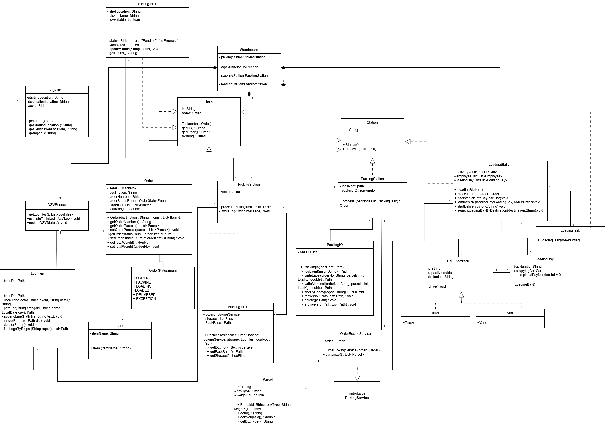

# FH---MDT-Compact-Programming-Course

Group work assignments for the Java Compact Programming Course

### Project Requirements - Amazon Fulfillment Center

The Homework Assignments and Capstone Project have a shared project idea. The project is the Amazon Fulfillment center,
which is a real life adaption of the warehouse systems from the Self assignments. The warehouse processes cover the
general processes which an order goes through before it is delivered to a customer. The warehouse itself is divided into
four different stations, which cover the core functionality in the process of ordering products.
After the placement of the order, each order goes through every station one after another.

#### Picking station

The picking station is the first station at which the order is being handled. There, the different items are being
picked from inventory shelves so that the items can be transported to the next station.

#### AGV runner

The AGV runner itself is not a real station, but shares key points with the other stations. The AGV runner is a
self-driving robot which can carry a load of different items. The main goal is to transport the items of an order to the
next station. Precisely, it transports items from the Picking station to the Packing station or from the Packing station
to the Loading station.

#### Packing station

The Packing station receives the items from the AGV runner, which have to be wrapped up into a box. The box size is
automatically calculated based on the weight of the items. The wrapped up items are afterward handed over to the AGV
runner that will transport the parcels to the Loading station.

#### Loading station

The Loading station is the final part inside the warehouse system. It takes the parcels and puts them into delivery
vehicles based up on weight of the parcels and their destination. Two workerType of employees work at the Loading station.
Loader employees fill up the delivery vehicles with parcels and make them ready to be delivered. Driver employees take
care of delivering the loaded parcels to the customer.

### Project diagrams

### Homework assignment 1

    - Lennart Ziehm 7201519: LoadingStation and related classes
    - Yasaman OladzadAbasabadi 7223229: PickingStation and related classes
    - Niloufar OladzadAbasabadi 7223228: AGVRunner and related classes
    - Marianne Nosseir 7224660: PackingStation and related classes

### Homework assignment 2

    - Lennart Ziehm 7201519: LoadingStation and related classes
    - Yasaman OladzadAbasabadi 7223229: PickingStation and related classes
    - Niloufar OladzadAbasabadi 7223228: AGVRunner and related classes
    - Marianne Nosseir 7224660: PackingStation and related classes

### Homework assignment 3

    - Lennart Ziehm 7201519: LoadingStation and related classes & AGV energy loading
    - Yasaman OladzadAbasabadi 7223229: PickingStation and related classes
    - Niloufar OladzadAbasabadi 7223228: AGVRunner and related classes
    - Marianne Nosseir 7224660: PackingStation and related classes

Answers to the questions regarding the Home Assignment 3 can be found under [src/HomeworkAssignment3/home-assignment3-answers.md](src/HomeworkAssignment3/homework-assigment3-answers.md)

### Capstone project

    - Lennart Ziehm 7201519: LoadingStation and related classes
    - Yasaman OladzadAbasabadi 7223229: PickingStation and related classes
    - Niloufar OladzadAbasabadi 7223228: AGVRunner and related classes
    - Marianne Nosseir 7224660: PackingStation and related classes

---

## Preparing tasks

### Self assignment 1

    - Problem 1: Yasaman OladzadAbasabadi 7223229
    - Problem 2: Lennart Ziehm 7201519
    - Problem 3: Niloufar OladzadAbasabadi 7223228
    - Problem 4: Lennart Ziehm 7201519

### Self assignment 2

    - Class implementation part 1: Marianne Nosseir 7224660
        - Implementation of IndustrialProcess & SingleOperation classes and IOperation interface
    - Class implementation part 2: Lennart Ziehm 7201519
        - Implementation of AGV and Position classes
    - Self designed analysis task 1: Yasaman OladzadAbasabadi 7223229
        - Analysis of SingleOperation & IndustrialProcess classes. 
            - Calculation of the average nominalTimeMinutes of all Operations
            - Calculation of the fastest and the slowest Operation
            - Printing a sorted list in the order of finish time of each SingleOperation
    - Self designed analysis task 2: Niloufar OladzadAbasabadi 7223228
        - Analysis of the AGV class. Test for checking:
            - if any AGV has less than 20 percent of battery left
            - if any AGV is used multiple time for different operations
            - which AGV is the fastest overall

### Self assignment 3

    - Lennart Ziehm 7201519: Implementation of HardwareResources, NonHumanResources, Resource + UML-Diagram
    - Yasaman OladzadAbasabadi 7223229: Implementation of TransportOperation, HumanOperation and reworking IOperation
    - Niloufar OladzadAbasabadi 7223228: Implementation of HumanResources, MaterialResources and SoftwareResources
    - Marianne Nosseir 7224660: Implementation of Process, ManagementProcess and IndustrialProcess

